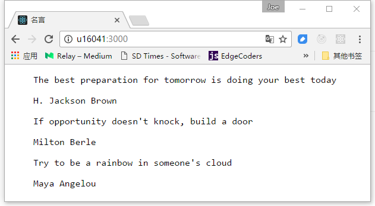

# swzql
发布Swzvideo数据库的GraphQL API


## Learn GraphQL and Relay读书笔记

### 4. 配置React应用程序使用Relay

#### 增加读取用户数

#### 名言库

#### Setting up Webpack
    yarn add -D webpack@1.14.0

#### 用法

`启动GraphQL服务`

```
root@u16041:~/swzql/Server/Trunk# yarn start:mysql
yarn start:mysql v0.21.3
$ nodemon ./swzvideo_graphql_mysql/server.js --exec babel-node
[nodemon] 1.11.0
[nodemon] to restart at any time, enter `rs`
[nodemon] watching: *.*
[nodemon] starting `babel-node ./swzvideo_graphql_mysql/server.js`
Noe brower to u16041:8080/graphql

```

`编译客户端`

```
root@u16041:~/swzql/Client/Trunk# yarn start:build
yarn start:build v0.21.3
$ webpack
Hash: 2bb43531d8cb3b1513ec
Version: webpack 1.14.0
Time: 3353ms
    Asset     Size  Chunks             Chunk Names
bundle.js  1.59 MB       0  [emitted]  main
    + 481 hidden modules
Done in 3.84s.

```

`启动服务器`

···
root@u16041:~/swzql/Client/Trunk# yarn start:dev
yarn start:dev v0.21.3
$ node server.js
Running a Client at http://:::3000
···

**在chrome浏览器中打开链接**[用户信息](http://u16041:3000/)



